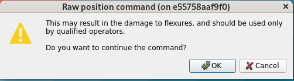
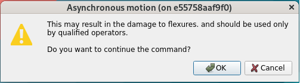
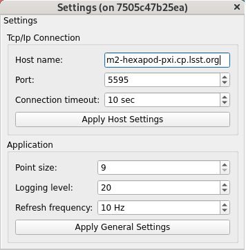
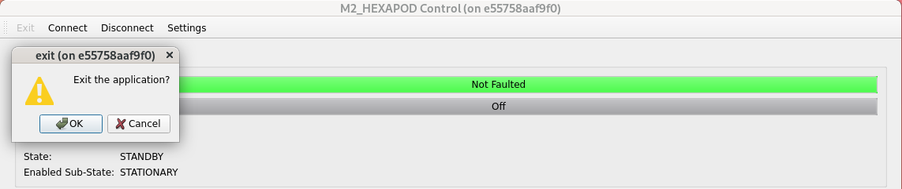
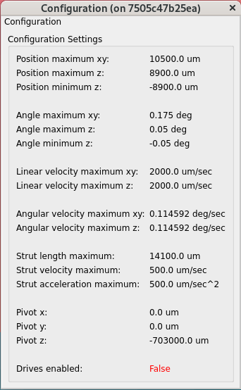
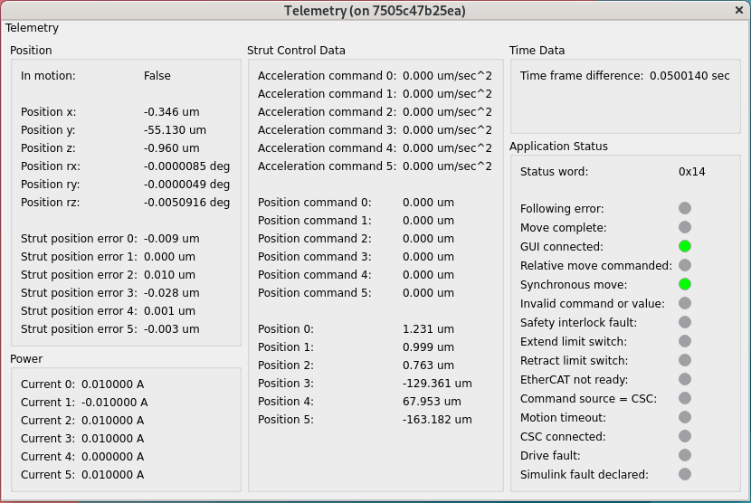
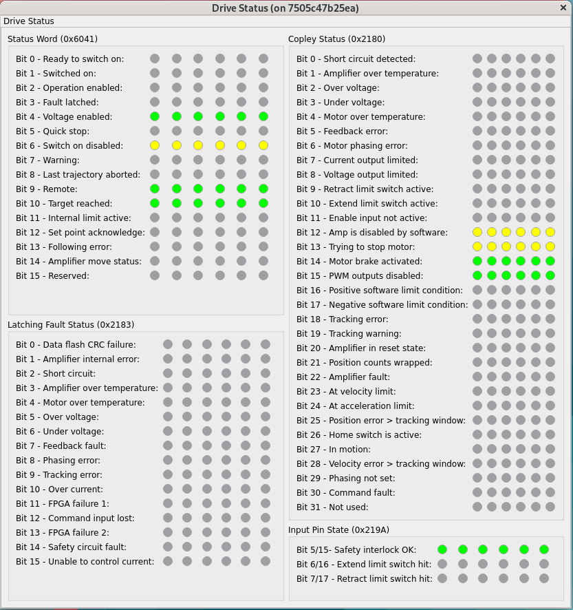
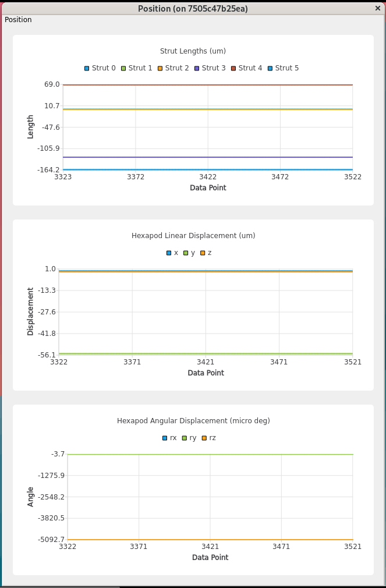
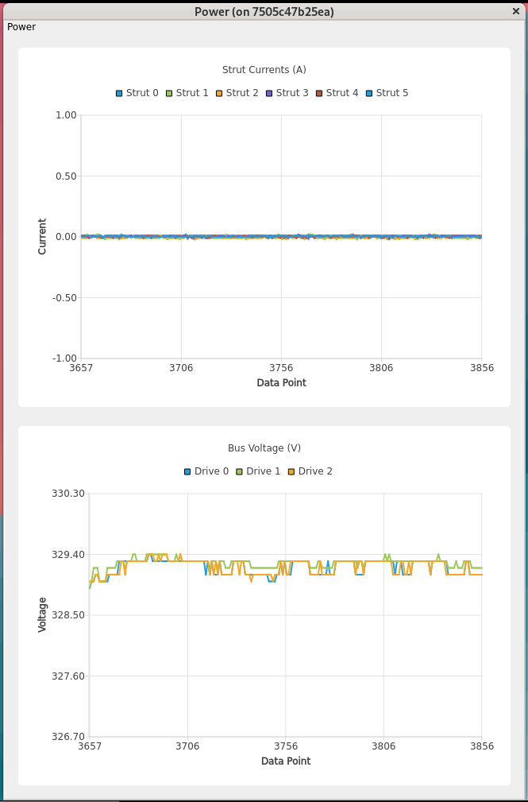

.. _User_Guide:

################
User Guide
################

This graphical user interface (GUI) is a Qt-based application to control the actuators, observe sensor telemetry, show the configurable parameter settings of the hexapod control system, clear errors, and diagnose issues observed during the operation.
This GUI is supposed to be used by the hardware engineers or operators to have a more detailed control of hardware compared with the automatic or remote mode (a.k.a. commandable SAL component, CSC): `ts_mthexapod <https://ts-mthexapod.lsst.io/>`_.
If the GUI can not enable the system, the hexapod CSC will not be able to as well because they are using the same interface to the control system.
Functionality of the GUI will be discussed in detail to provide the reader a comprehensive source for understanding the operation of GUI.

.. note::
  This GUI is to replace the original LabVIEW GUI: `ts_hexapod_gui <https://github.com/lsst-ts/ts_hexapod_gui>`_, and the related executables are ``runCamHexEui`` and ``runM2HexEui``.

.. _Controller_State:

Controller State
================

The following states are defined in the hexapod controller:

.. _Controller_State_standby:

Standby State
-------------

The **Standby** state has no substates.
No motion can be commanded from this state and the motor drives remain disabled.
To transition from **Standby** state to **Enabled** state, an enabled state command must be sent.
In the transitioning, the control system will read the configuration file in controller, and apply the related settings.

.. _Controller_State_enabled:

Enabled State
-------------

In the **Enabled state**, the motor drives are enabled and motion can be commanded.
To transition back to **Standby** state from the **Enabled** state, a standby state command must be sent.

There are two substates within the **Enabled** State: **Stationary** and **MovingPt2Pt**.
When entering **Enabled** state, the system will begin in **Stationary** substate.
After setting the strut or hexapod position, you can send an enabled-substate command of **Move** to do the movement.
When this occurs, the system will transition from **Enabled**/**Stationary** substate to **Enabled**/**MovingPt2Pt** substate.
When all six actuators have completed their motion, the system will automatically transition back to **Enabled**/**Stationary** substate and will then be ready to receive new commands.

.. _Controller_State_fault:

Fault State
-------------

If a fault occurs in the **Enabled** state, the system will automatically transition to the **Fault** state.
While in the **Fault** state, a state command of clear-error will cause a transition to the **Standby** state and will also clear any errors that are no longer present.

.. _Operation:

Operation
============

Use the command line in terminal to run the GUI by ``run_hexgui <hexapod>``, where ``<index>`` is 1 for the camera hexapod, 2 for the M2 hexapod.
The simulation mode is provided to let you to be familiar with the application.
You can do the following to get more information of GUI.

.. code:: bash

    run_hexgui -h

By default, there will be a log file created under the ``/rubin/hexapod/log`` or ``$HOME`` directory to support the debug.
You can assign the `logging level <https://docs.python.org/3/library/logging.html#logging-levels>`_ from the command line or use the GUI (see :ref:`lsst.ts.hexgui-user_settings`).

The operation of GUI is explained below.
For each action (or click the button), you need to wait for some time to let the GUI finish the related command with the control system in the timeout period.

.. _lsst.ts.hexgui-user_control_panel:

Control Panel
-------------

.. figure:: ../screenshot/control_panel.png
  :width: 550

  Control panel of application

After the execution of GUI, you will see the above control panel.
You can use the top toolbar to change the **Settings** of GUI, **Connect**/**Disconnect** the hexapod controller, and **Exit** the application.

The top region of control panel shows the summary of the hexapod system.
You can see that whether the hexapod is in fault, the Copley drives are enabled, the command source is GUI or CSC, the current controller's state, and the sub-enabled state.

The middle region of control panel lists the available commands to the control system.
Once a command is selected, the related parameters will be shown as well to let you change the values.
For the dangerous commands, you need to confirm the action in the following prompt dialogs:

  Raw command dialog to set the new strut's position.

  Asynchronous command dialog to asynchronously move the position.

After selecting the command and changing the parameters, you can click the **Send Command** button to send the command to the control system.

The bottom region of control panel has multiple tables that you can double-click to open to have more detailed system information.
If you move the mouse close to the buttons/indicators and texts in the panel and tables, you will see the prompted tips to explain the related details.

.. _lsst.ts.hexgui-user_important_command:

Important Commands
^^^^^^^^^^^^^^^^^^

Some important commands are listed below:

#. State command lets you change the controller's state between **Standby** and **Enabled** states. If there is the fault, you can clear the error here.

#. Enabled-sub-state command lets you move the hexapod once setting the strut/hexapod position or stop the hexapod's movement.

#. Set-pivot command allows you to change the center of rotation of the hexapod in x, y, and z coordinates in microns.

#. Switch-command-source command sets the command source to be GUI or CSC.

#. Mask-limit-switch command masks the limit switch of the hexapod. This is needed to move off of a limit switch if a switch is ever activated. If a limit switch is tripped, send this command and the system temporarily ignores the limit switch and allows the system move off the switch. Once the system moves off the switch, limit switch functionality returns to normal operation.

.. _lsst.ts.hexgui-user_settings:

Settings
--------

  Settings of application

You can modify the settings in application.
The default values come from the configuration file.
You can do the following things:

#. Update the host name, port, and connection timeout in TCP/IP connection.

#. General settings of application. You can use the different `logging level <https://docs.python.org/3/library/logging.html#logging-levels>`_ to support the debugging if needed. The log file will be in the ``/rubin/hexapod/log`` directory. If it does not exist in file system, the log file will be in the ``$HOME`` directory.

After the modification of settings, you can click the related **Apply** button to use the new values.

.. _lsst.ts.hexgui-user_exit:

Exit
----

  Exit the application

You can click the **Exit** button to leave the application, and a window will prompt out to confirm this action.
Before the exit, you need to disconnect the GUI from the controller first.
Since the default command source should be CSC, there will a warning dialog to notify you if the current command source is GUI.

.. _lsst.ts.hexgui-user_configuration:

Configuration
-------------

  Configuration

You can use the configuration table to observe the current values of the configurable parameters in the hexapod controller.
It shows the hexapod position and velocity limits, and actuator position, velocity, and acceleration limits.
It also shows the current pivot position as well.

.. _lsst.ts.hexgui-user_telemetry:

Telemetry
---------

  System telemetry

You can use the telemetry table to observe the current telemetry in the hexapod controller.
At the left of table, the current position and power of the hexapod are displayed, and it also shows whether the hexapod is in motion.
The position error between the actual position and commanded position is shown for each actuator.
These errors are generally within 1 micron at the completion of a move and up to 40 microns during a move.

At the middle of table, the strut acceleration commands, strut position commands, and actual strut positions for all six actuators are shown as the current hexapod position in all six axes.
The respective units are listed for each display item.

At the right of table, the time between telemetry samples is displayed.
By default, the telemetry is 20 Hz and you should expect to see the time frame difference is around 0.05 seconds.
The application status items are displayed to show the current status of the hexapod controller.
These indicators are especially useful for troubleshooting and diagnostics such as the safety interlock, limit switches, drive fault, Simulink fault, and others.

.. _lsst.ts.hexgui-user_drive_status:

Drive Status
------------

  Copley drive status

You can use the drive status table to observe the current Copley drive status.
It includes the status words, latched faults, manufacturer’s (Copley motor drive) status, and input pins information.
It is primarily used for diagnostics and troubleshooting.

.. _lsst.ts.hexgui-user_position:

Position
--------

  Hexapod position

You can use the position table to observe the current hexapod and strut positions.
The top shows the time history of the six strut positions.
The middle shows the time history of the three translation axes of the hexapod.
The bottom shows the time history of the three rotation axes of the hexapod.

.. _lsst.ts.hexgui-user_power:

Power
-----

  Power status

You can use the power table to observe the strut's currents and bus voltages.
The top shows the current of six struts.
The bottom shows the bus voltage of three drives.
Each drive has two struts connected to it.
For example, the drive 0 has struts 0 and 1 connected to it, and vice versa.
